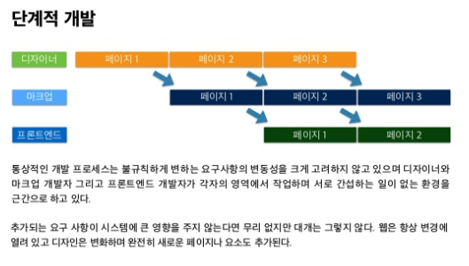
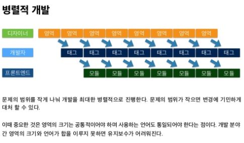
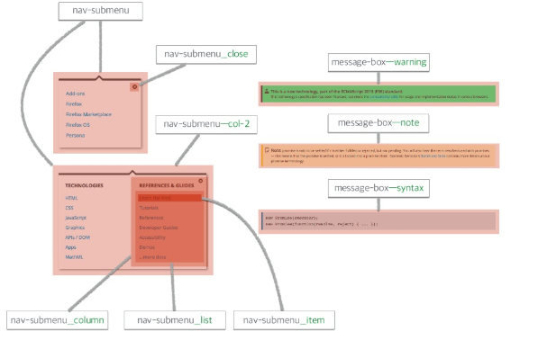
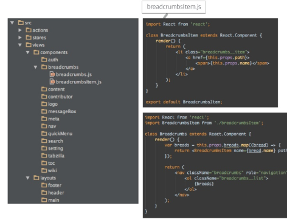

# css 방법론 - BEM

## What is BEM?

BEM은 `블럭`(Block), `요소`(Element), `변환자`(Modifier)의 앞 철자를 따서 만든 개발 및 설계 방법론이다.  
객체를 코드로 표현하는 방법과 일련의 패턴이 들어난다.

### `블럭`이란?

애플리케이션의 구성요소로써 독리된 존재이다.

블럭은 문맥 의존적이지 않은 독립된 객체 또는 높은 수준으로 추상화된 컴포넌트이다. 하위의 *요소*만 포함할 수도 있고, 또 다른 블럭을 포함할 수도 있다.

### `요소`란?

영역을 구성하는 작은 단위 또는 자식이다.

요소는 블럭을 구성하는 작은 단위로써 특정 기능을 담당한다. 블럭과 달리 문맥 의존적이며 요소가 속한 블럭 내에서만 의미를 갖는다.

### `변환자`란?

블럭이나 요소의 스타일이나 동작을 표현한다.

숨겨놓은 요소를 출력하거나 특정 버튼에 커서를 올렸을 때 배경색을 변경하는 등 블럭이나 요소의 상태를 표현함.

## BEM의 목표

1. 빠른 개발 속도  
   단계적이 아닌 **병렬적**으로 개발을 진행하여 웹 사이트의 첫 버전을 _신속히_ 공개하기 위함.

2. 효율적인 유지보수  
   오랜기간 동안 효율적으로 유지보수 할 수 있는 구조와 커뮤니케이션 방법 확립하기 위함.

3. 팀의 확장성  
   급격한 학습 곡선 없이 새로운 맴버를 할당할 수 있는 환경 조성을 위함.

4. 코드의 재사용  
   UI의 일관성을 유지하고 재사용성을 높이기 위해 문맥적인 의존 없는 모듈 개발을 위함.

## 개발단계



- 각각의 작업자들이 서로 간섭하지 않고 각자의 영역에서 작업.



- 각각의 작업자들 끼리 작업을 병렬적으로 나눠서 진행.

## Unified Data Domain

서로 각자 간섭없이 개발하는게 아니라 블럭의 이름을 함께 짓고, 이해관계자가 공통적으로 용어를 사용함. 이름 UDD(Unified Data Domain)라고 함.

각 영역에 이름을 붙이고 함께 사용하면 커뮤니케이션 비용을 낮출 수 있다. 변경이 필요한 영역을 정확하게 알려줄 수 있고 각 영역을 조합해 새로운 영역을 만들어 낼 때도 몇 마디 만으로 의사를 전달 할 수 있다.

## MindBEMding

BEM 방법론을 기반으로 한 명명법.

BEM은 클래스 명명 규칙을 강제하지 않는다. 많은 사람이 오해하고 있는 호불호가 극명하게 갈리는 명명법은 BEM방법론을 기반으로 한 MindBEMing 명명법이다. 다른 것으로 modified BEM이 있다.

## BEM으로 돌아와서..

### 블럭 나누고 이름 짓기

디자이너와 함께 블럭의 이름을 정함. 한 페이지의 디자인이 모두 완료 될 때까지 기다리는게 아니라 블럭마다 디자인 결과물을 전달받아 모듈을 개발.

다음은 디자이너와 함께 블럭에 이름을 정하는 예제이다.


### 요소와 변환자 찾아내기

블럭을 나누고 이름을 지었으면 블럭을 구성하는 요소를 판별한다. 또한 블럭과 요소에 필요한 변환자도 찾아낸다.

다음은 블럭의 변환자를 정하는 예제이다.


### 마크업, 스타일링 작성

블럭의 이름을 정하고, 디자인을 전달 받으면 마크업 및 스타일링 작업에 들어간다. 블럭 이름으로 HTML파일과 SASS파일을 생성하고, 문맥 의존적이지 않도록 모듈을 작성.

파일명 만 보더라도 어느 블럭이 마크업인지 또는 스타일링인지 즉각 알 수 있도록 파일명을 지정한다.

이러한 이유는 디자이너가 특정 블럭의 디자인을 변경할 경우 빠르게 접근하여 반영할 수 있기 때문이다. 또한 몇몇 블럭을 조합해 새로운 블럭을 만들어도 작은 단위로 나누었기 때문에 빠르게 개발할 수 있다. Sass3부터 MindBEMding 명명법으로 서술하기에 적합한 `@at-root`, `# {}` 보간이 추가 됐기 때문에 이 둘은 이질감 없이 잘 어울린다.


### 자바스크립트

자바스크립트에서 블럭은 하나의 뷰 및 뷰 컴포넌트 또는 템플릿 단위가 된다. 블럭별로 잘 컴토넌트화 하여 UI 개발에서 유용하게 사용한다. ( React 코드를 짤때, 블럭별로 컴포넌트를 나눈다. )

React.js 라이브러리가 뷰를 컴포넌트 단위로 작성하기 때문에 BEM 방법론과 잘 어울린다.



## BEM의 목표달성 및 기대효과

문제의 크기를 작게 나누면 병렬적으로 개발가능하고 변경에 기민하게 대응할 수 있어 빠르게 개발할 수 있다.

이해관계자가 공통으로 이해하는 용어로 소통하고, 파일명 만으로도 변경이 필요한 블럭을 추적할 수 있어 유지보수에 용이하다.

단순하고 명확한 규칙과 명명법으로 새로운 팀원이 투입되도 큰 이해 비용 없이 개발에 착수 할 수 있다.

문맥을 의존하지 않는 단일 객체로써 블럭을 모듈화 하여 재사용성을 극대화할 수 있다.

## 개인적인 느낌

BEM을 공부해보면서 느낀게 여러 장점이 있지만 그에 따르는 단점도 있는 것 같다.  
먼저 장점은 병렬적으로 나눠서 진행해서 여러사람이 함께 개발을 진행하는데 도움이 될 것 같고, 무엇보다 블럭별로 정리하는 부분이 가장 마음에 들었다.  
하지만 사람들이 여러명이 아니고 혼자서 개발을 진행한다면 빠른 속도라는 장점이 없어질 것 같고, 규칙을 따라서 코딩하는 느낌이 들어서 자유롭지 못할 것 같다.

## 추가할 점...

### 2019년 04월 16일

BEM에 대한 이해도가 부족하다고 생각되어 다시 한번 공부를 해 보았다. 한층 발전하고 다시 한번 공부해보니까 이해가 훨씬 잘되고 공부했던 것 중에서 잘못된 점을 찾았다.

#### 요소와 변환자

예제를 들어 설명 하도록 하겠다.

```javascript
<!-- DO THIS -->
<figure class="photo">
  
  <figcaption class="photo__caption">
    <blockquote class="photo__quote">
      Look at me!
    </blockquote>
  </figcaption>
</figure>

<style>
  .photo { }
  .photo__img { }
  .photo__caption { }
  .photo__quote { }
</style>
```

---

```javascript

<!-- DON'T DO THIS -->
<figure class="photo">
  
  <figcaption class="photo__caption">
    <blockquote class="photo__caption__quote"> <!-- never include more than one child element in a class name -->
      Look at me!
    </blockquote>
  </figcaption>
</figure>

<style>
  .photo { }
  .photo__img { }
  .photo__caption { }
  .photo__caption__quote { }
</style>
```

요소는 class이름을 지을때 단 한번만 들어가야 한다. 위의 예제와 아래의 예제에서 차이점은

```javascript
  // 위
  <blockquote class="photo__quote">
    Look at me!
  </blockquote>

  // 아래
  <blockquote class="photo__caption__quote"> <!-- never include more than one child element in a class name -->
    Look at me!
  </blockquote>
```

이 코드 뿐이다. 이때 위의 코드가 옳고 아래의 코드가 틀렸다. class이름에는 하나의 요소만 들어가야 한다 예를 들어서 `class="a_-b__c"`는 틀리고 `class="a__b--c"`는 옳다.
